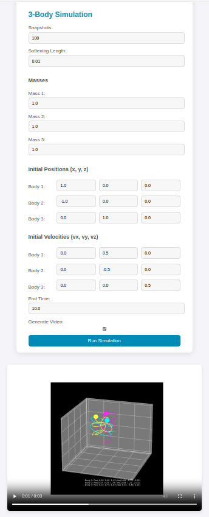

# 🌌 3-Body Problem Simulation

Welcome to the **3-Body Problem Simulation**! 🚀 This project visualizes the complex interaction between three celestial bodies governed by Newton's law of gravitation. Perfect for exploring chaotic systems and dynamic simulations. 

<p align="center">
  
</p>

## 🎥 Simulation Preview
Here’s a sneak peek at the 3-Body problem in action:
<p align="center">
  
</p>

## 💡 Features
- **Dynamic 3-Body Interaction:** Observe how three bodies influence each other's paths in space.
- **Custom Parameters:** Input custom masses, initial positions, and velocities.
- **Visual Output:** Generate a video to visualize the simulation.
- **Intuitive UI:** Easy-to-use web interface for controlling simulations.

## 📖 How to Use
1. Clone the repository: 
   ```bash
   git clone https://github.com/your-username/3-Body-Problem-Simulation.git
   
Install the necessary dependencies:

```
sudo apt install ffmpeg

```

```
conda env create -f myenv.yaml
```                                                              
                                                               
```
conda activate simulation
```


Open the app in your browser at http://localhost:5000 and input your simulation parameters.
```
flask run
```
or 
```
python app.py
```


🚀 Technologies Used
Flask for the backend.
CSS and HTML5 for the frontend.
Matplotlib and NumPy for simulation and visualization.


💻 Project Structure

📂 3-Body-Problem-Simulation
├── 📁 static
│   └── 📁 images
│       ├── app.png
│       └── simulation_video.gif
├── 📁 templates
│   └── index.html
├── app.py
├── requirements.txt
└── README.md


📅 Future Plans
Add 3D visualization with Plotly.
Implement additional celestial body interactions.
Enhance performance with WebGL or Three.js.

✨ Contributing
Feel free to fork this repository, submit issues, and contribute! 🙌

📄 License
This project is licensed under the MIT License.


REFERENCES

How do computers "solve" the three-body-problem?
By HowContainer: Physics Stack ExchangeYear: 2019URL: https://physics.stackexchange.com/questions/456808/how-do-computers-solve-the-three-body-problem


Modelling the Three Body Problem in Classical Mechanics using Python
By Gaurav DeshmukhContainer: MediumPublisher: Towards Data ScienceYear: 2019URL: https://towardsdatascience.com/modelling-the-three-body-problem-in-classical-mechanics-using-python-9dc270ad7767
